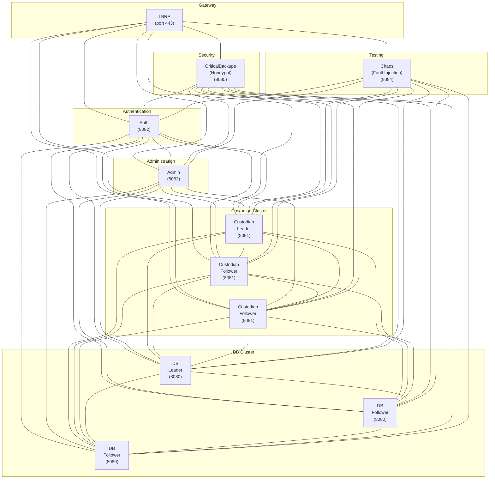

# NGI Architecture Documentation

## Table of Contents

1. [Overview](#overview)
2. [Technology Stack](#technology-stack)
3. [Workspace Structure](#workspace-structure)
4. [Consensus & Distributed Systems](#consensus--distributed-systems)
5. [Database Architecture](#database-architecture)
6. [Security Architecture](#security-architecture)
7. [Service Descriptions](#service-descriptions)
8. [Inter-Service Communication](#inter-service-communication)
9. [Configuration Management](#configuration-management)
10. [Deployment Model](#deployment-model)
11. [Data Models](#data-models)
12. [API Specifications](#api-specifications)

---

## Overview

NGI (Next-Gen Infoman) is a distributed, microservices-based tech support ticketing system designed for high availability, strong consistency where needed, and quantum-resistant security. The system is built entirely 
in Rust to leverage memory safety, fearless concurrency, and high performance.

### Core Principles

- **Safety First**: No unsafe code (`#![forbid(unsafe_code)]`) in business logic
- **Distributed Consistency**: Raft consensus for critical services
- **Post-Quantum Security**: Double encryption (TLS 1.3 + Kyber)
- **Zero Downtime**: Multi-instance deployment with automatic failover
- **Type Safety**: Rust-native APIs throughout (no SQL injection risks)
- **Schema Evolution**: Versioned data models with lazy migrations for live field/workflow changes

---

## Technology Stack

### Core Dependencies

| Component | Crate | Version | Purpose |
|-----------|-------|---------|---------|
| **Web Framework** | `axum` | latest | REST surface for browsers (LBRP) |
| **Async Runtime** | `tokio` | latest | Async I/O, task scheduling |
| **Database** | `sled` | latest | Embedded key-value store |
| **Consensus** | `openraft` | latest | Raft protocol for distributed consensus |
| **TLS** | `rustls` | latest | Pure Rust TLS 1.3 implementation |
| **Post-Quantum Crypto** | `pqc_kyber` | latest | CRYSTALS-Kyber KEM |
| **gRPC Framework** | `tonic` + `prost` | latest | Service-to-service RPC over HTTP/2 |
| **Serialization** | `serde` + `bincode` | latest | Efficient binary serialization |
| **Message Passing** | `tokio::sync::mpsc` | (built-in) | Internal component pipelines |
| **HTTP Client** | `reqwest` | latest | Outbound REST integrations |

### Development Tools

- **Linting**: `cargo clippy` with pedantic warnings
- **Formatting**: `cargo fmt` with default settings
- **Testing**: `cargo test` with integration tests (TDD workflow)
- **Coverage**: `cargo tarpaulin` (90% minimum)
- **Security**: `cargo audit` for dependency vulnerabilities
- **Watch Mode**: `cargo watch` for continuous test execution during TDD

---

## Workspace Structure

```
ngi/
├── Cargo.toml              # Workspace definition
├── README.md               # User-facing documentation
├── ARCHITECTURE.md         # This file
├── .github/
│   └── workflows/
│       └── rust.yml        # CI/CD pipeline
│
├── common/                 # Shared library crate
│   ├── Cargo.toml
│   └── src/
│       ├── lib.rs
│       ├── ticket.rs       # Ticket types and enums
│       ├── user.rs         # User types
│       ├── error.rs        # Error types
│       └── config.rs       # Configuration utilities
│
├── consensus/              # Raft wrapper library
│   ├── Cargo.toml
│   └── src/
│       ├── lib.rs
│       ├── raft_node.rs    # Raft node abstraction
│       └── state_machine.rs
│
├── config/                 # Service discovery library
│   ├── Cargo.toml
│   └── src/
│       ├── lib.rs
│       └── discovery.rs    # Service registry
│
├── db/                     # Database service (binary)
│   ├── Cargo.toml
│   └── src/
│       ├── main.rs
│       ├── storage.rs      # Sled wrapper
│       ├── raft_sm.rs      # Raft state machine
│       └── api.rs          # gRPC service handlers (tonic)
│
├── custodian/              # Ticket management service (binary)
│   ├── Cargo.toml
│   └── src/
│       ├── main.rs
│       ├── locks.rs        # Distributed lock management
│       ├── raft_sm.rs      # Raft state machine
│       └── api.rs          # gRPC service handlers (tonic)
│
├── auth/                   # Authentication service (binary)
│   ├── Cargo.toml
│   └── src/
│       ├── main.rs
│       ├── mfa.rs          # Multi-factor auth logic
│       ├── session.rs      # Session management
│       └── api.rs          # gRPC service handlers (tonic)
│
├── admin/                  # Admin & monitoring service (binary)
│   ├── Cargo.toml
│   └── src/
│       ├── main.rs
│       ├── monitoring.rs   # Metrics collection
│       ├── users.rs        # User/role management
│       └── api.rs          # gRPC service handlers (tonic)
│
├── lbrp/                   # Load Balancer & Reverse Proxy (binary)
│   ├── Cargo.toml
│   └── src/
│       ├── main.rs
│       ├── proxy.rs        # Reverse proxy logic
│       ├── balancer.rs     # Load balancing algorithms
│       └── static_files.rs # Frontend asset serving
│
├── chaos/                  # Fault injection service (binary)
│   ├── Cargo.toml
│   └── src/
│       ├── main.rs
│       └── injector.rs     # Chaos scenarios
│
├── honeypot/               # Intrusion detection honeypot (binary)
│   ├── Cargo.toml
│   └── src/
│       ├── main.rs
│       ├── traps.rs        # Fake endpoints and data
│       └── reporter.rs     # Alert reporting to admin
│
└── tests/                  # Integration tests
    ├── Cargo.toml
    └── src/
        └── lib.rs
```

---

## Consensus & Distributed Systems

### Why Raft?

**Raft** was chosen over Paxos for the following reasons:

1. **Understandability**: Raft is designed to be understandable. Its leader-based approach and clear role separation make it easier to reason about correctness.
2. **Proven in Production**: Used by etcd (Kubernetes), TiKV (TiDB), and Consul
3. **Strong Consistency**: Provides linearizable reads/writes through leader
4. **Leader Election**: Automatic failover when leader fails
5. **Log Replication**: Ensures all nodes eventually agree on state
6. **Rust Implementation**: `openraft` is a mature, pure-Rust implementation

### Services Requiring Consensus

#### 1. Database Service (`db`)

**Why Consensus?**
- Data integrity across replicas
- Consistent reads/writes
- Durable storage guarantees

**Configuration:**
- **Minimum instances**: 3 (required for Raft quorum and fault tolerance)
- **Replication mode**: Leader-based (writes to leader, reads from any)
- **State machine**: Key-value operations on Sled
- **Quorum math**: With 3 nodes, system tolerates 1 failure (needs 2/3 for consensus)

**Raft Role:**
- Leader handles all write operations
- Followers replicate the log
- If leader fails, a follower becomes leader automatically

#### 2. Custodian Service (`custodian`)

**Why Consensus?**
- **Critical**: Prevent ticket lock race conditions
- Ensure only one user can lock a ticket at any time
- Coordinate across multiple custodian instances

**Configuration:**
- **Minimum instances**: 3 (required for Raft quorum and fault tolerance)
- **Replication mode**: Leader-based (lock operations through leader)
- **State machine**: Ticket lock state
- **Quorum math**: With 3 nodes, system tolerates 1 failure (needs 2/3 for consensus)

**Raft Role:**
- Lock acquisition/release goes through leader
- Linearizable consistency guarantees no double-locking
- If leader fails, locks are preserved in replicated log

### Services Without Consensus (Stateless)

- **Auth**: Session state stored in DB, service is stateless
- **Admin**: Reads/writes through DB service
- **LBRP**: Routes requests, no state to coordinate
- **Chaos**: Test service, intentionally unpredictable

These can run single-instance for MVP and scale horizontally without coordination.

---

## Database Architecture

### Storage Layer: Sled

**Sled** is an embedded ordered key-value store written in pure Rust. It provides:

- **ACID transactions**: Atomic, consistent, isolated, durable
- **Embedded**: No separate server process
- **Fast**: Lock-free, optimized for modern hardware
- **Safe**: Written in safe Rust

### Relational Layer: Custom

We build a **type-safe relational layer** on top of Sled's key-value interface.

#### Key Design

Keys are structured with prefixes to simulate tables:

```
ticket:{ticket_id} -> Ticket struct (bincode)
ticket:index:status:{status}:{ticket_id} -> empty value (for queries)
ticket:index:assigned:{user_id}:{ticket_id} -> empty value
user:{user_id} -> User struct
lock:{ticket_id} -> LockInfo struct
```

#### Example Operations

**Insert Ticket:**
```rust
// Main record
db.insert(b"ticket:12345", bincode::serialize(&ticket)?)?;

// Secondary indexes
db.insert(b"ticket:index:status:Open:12345", &[])?;
db.insert(b"ticket:index:assigned:user42:12345", &[])?;
```

**Query by Status:**
```rust
let prefix = b"ticket:index:status:Open:";
for item in db.scan_prefix(prefix) {
    let (key, _) = item?;
    let ticket_id = extract_id_from_key(&key);
    let ticket = get_ticket(ticket_id)?;
    // ...
}
```

### Raft Integration

The Sled database is wrapped in a **Raft state machine**:

1. Client sends write request to any DB instance
2. Non-leader forwards to leader
3. Leader appends to Raft log
4. Log replicates to followers (quorum)
5. Leader applies to Sled, returns success
6. Followers apply to their Sled instances

This ensures all DB replicas have identical state.

---

## Security Architecture

### Network Encryption: Double-Layer

**Layer 1: TLS 1.3 (Transport)**
- All HTTP traffic uses HTTPS via `rustls`
- Certificate-based authentication between services (mTLS)
- Perfect forward secrecy with modern cipher suites

**Layer 2: Post-Quantum KEM (Application)**
- Kyber-768 key encapsulation for additional protection
- Wraps sensitive payloads (e.g., session tokens, ticket data)
- Protects against future quantum computer attacks

#### Encryption Flow

```
Client -> LBRP -> Service

1. TLS 1.3 handshake establishes secure channel
2. Application payload encrypted with Kyber-derived key
3. Encrypted payload sent over TLS connection
4. Recipient decrypts Kyber layer, then processes
```

### Authentication & Authorization

**Multi-Factor Authentication (MFA) Methods:**

*Pre-v1.0:*

1. **Password**
2. **TOTP**
3. **WebAuthn**
4. **U2F**

*Anticipated v1.0 Addition:*

5. **Active Directory Integration**
   - OS-level authentication counts toward MFA
   - LDAP/Kerberos integration

**Role-Based Access Control (RBAC):**
- Roles: Admin, Manager, Technician, EbondPartner, ReadOnly
- Permissions: CreateTicket, LockTicket, UpdateTicket, ManageUsers, etc.
- Stored in DB service, enforced by all services

### Certificate Management (mTLS)

Each service has:
- **Private key**: Never leaves the service
- **Certificate**: Signed by internal CA
- **CA certificate**: Used to verify peer certificates

Services only accept connections from other services with valid certificates.

---

## Service Descriptions

### Database Service (`db`)

**Purpose**: Centralized data persistence with distributed consensus

**Port**: `8080` (gRPC over HTTP/2, configurable)

> **Note on Port Numbers**: The 808x port range is used for memorability and to avoid common port conflicts. Real security comes from mTLS authentication and network isolation, not port obscurity. Attackers scan all ports regardless of number.

**gRPC Methods**:
- `CreateTicket(TicketWrite)` → `Ticket` (persists ticket, assigns ID)
- `GetTicket(TicketLookup)` → `Ticket`
- `UpdateTicket(TicketWrite)` → `Ticket`
- `SoftDeleteTicket(TicketLookup)` → `DeleteAck`
- `QueryTickets(QueryRequest)` → `stream Ticket`

> **Soft Delete vs Hard Delete**: NGI uses **soft deletes** exclusively for tickets and users. Records are marked `deleted: true` with a `deleted_at` timestamp but remain in the database. This enables:
> - Audit trails (who deleted what, when)
> - Accidental deletion recovery
> - Regulatory compliance (data retention policies)
> - Historical reporting and analytics
> Hard deletes (permanent removal) are never exposed via API and only performed during database maintenance with explicit approval.
- `CreateUser(UserWrite)` → `User`
- `GetUser(UserLookup)` → `User`
- `UpdateUser(UserWrite)` → `User`
- `SoftDeleteUser(UserLookup)` → `DeleteAck`

**Dependencies**:
- `sled` for storage
- `openraft` for consensus
- `tonic` for gRPC server/client plumbing

**Clustering**:
- **3 instances minimum** (recommended for Raft quorum)
- Leader handles writes
- Followers can serve reads (eventual consistency option)
- Quorum: 2 out of 3 nodes must agree for writes

---

### Custodian Service (`custodian`)

**Purpose**: Ticket lifecycle management with distributed locking

**Port**: `8081` (gRPC over HTTP/2, configurable)

**gRPC Methods**:
- `CreateTicket(CreateTicketRequest)` → `Ticket`
- `AcquireLock(LockRequest)` → `LockResponse`
- `ReleaseLock(LockRelease)` → `LockResponse`
- `UpdateTicket(UpdateTicketRequest)` → `Ticket`

**Key Features**:
- **Distributed locks**: Raft consensus prevents race conditions
- **Auto-lock expiry**: Locks expire after timeout (configurable)
- **Lock stealing prevention**: Only lock owner can release

**Dependencies**:
- `openraft` for lock coordination
- `db` service gRPC client for persistence
- `tonic` for gRPC server/client plumbing

**Clustering**:
- **3 instances minimum** (recommended for Raft quorum)
- Lock operations go through leader
- Quorum: 2 out of 3 nodes must agree for lock operations

---

### Auth Service (`auth`)

**Purpose**: User authentication and session management

**Port**: `8082` (gRPC over HTTP/2, configurable)

**gRPC Methods**:
- `AuthenticatePassword(PasswordLogin)` → `LoginResponse`
- `AuthenticateTotp(TotpChallenge)` → `LoginResponse`
- `AuthenticateWebauthn(WebauthnChallenge)` → `LoginResponse`
- `Logout(SessionToken)` → `LogoutAck`
- `VerifySession(SessionToken)` → `SessionState`
- `EnrollMfa(EnrollRequest)` → `MfaEnrollment`
- `RemoveMfa(RemoveRequest)` → `RemoveAck`
- `ChangePassword(ChangePasswordRequest)` → `ChangePasswordAck`

**Session Storage**:
- Sessions stored in DB service
- Short-lived JWT tokens (15 min)
- Refresh tokens (7 days)

**Dependencies**:
- `db` service gRPC client for user data and sessions
- `tonic` for gRPC server/client plumbing

**Clustering**:
- Stateless, can run 1+ instances
- No coordination needed (delegates to DB)

---

### Admin Service (`admin`)

**Purpose**: User management, roles, permissions, monitoring, and metrics

**Port**: `8083` (gRPC over HTTP/2, configurable)

**gRPC Methods**:
- `CreateUser(AdminUserWrite)` → `User`
- `UpdateUser(AdminUserWrite)` → `User`
- `SoftDeleteUser(AdminUserLookup)` → `DeleteAck`
- `CreateRole(RoleWrite)` → `Role`
- `AssignRole(RoleAssignment)` → `RoleAssignmentAck`
- `GetMetrics(MetricsRequest)` → `MetricsSnapshot`
- `GetHealth(HealthRequest)` → `HealthStatus`

**Monitoring Features**:
- Service health aggregation
- Request metrics (latency, throughput)
- Error rate tracking
- Resource usage (CPU, memory)
- Data export in CSV, XLSX, JSON, & Prometheus formats

**Dependencies**:
- `db` service gRPC client for user/role data
- gRPC clients to each service for health checks
- `tonic` for gRPC server/client plumbing

**Clustering**:
- Stateless, single instance for MVP

---

### LBRP Service (`lbrp`)

**Purpose**: Load balancing, reverse proxy, and static file serving

**Port**: `443` (HTTPS) / `80` (HTTP redirect)

**Routes**:
- `/api/ticket/*` → gRPC `CustodianService`
- `/api/auth/*` → gRPC `AuthService`
- `/api/admin/*` → gRPC `AdminService`
- `/api/db/*` → gRPC `DbService` (internal only)
- `/*` → Static frontend files

**Load Balancing Algorithm**:
- Round-robin for stateless services (auth, admin)
- Leader-aware routing for stateful services (db, custodian)

**Features**:
- TLS termination
- Request rate limiting
- CORS handling
- Compression (gzip, brotli)
- gRPC client pool with leader-aware routing

**Dependencies**:
- `config` crate for service discovery
- `tonic` for gRPC client connections

**Clustering**:
- Single instance for MVP
- Can use external LB (nginx, HAProxy) in front

---

### Chaos Service (`chaos`)

**Purpose**: Fault injection for resilience testing

**Port**: `8084` (gRPC over HTTP/2, configurable)

**Injection Types**:
- Network latency injection
- Service crash simulation
- Disk I/O delays
- CPU/memory pressure
- Raft leader failure

**gRPC Methods**:
- `InjectScenario(ChaosRequest)` → `ChaosAck`
- `StopScenario(StopRequest)` → `ChaosAck`
- `ListScenarios(ListRequest)` → `ScenarioCatalog`

**Safety**:
- Only enabled in test environments
- Requires admin authentication

**Dependencies**:
- `tonic` for gRPC server/client plumbing

**Clustering**:
- Single instance (chaos doesn't need HA!)

---

### Honeypot Service (`honeypot`)

**Purpose**: Intrusion detection via deceptive high-value targets

**Port**: `8085` (gRPC over HTTP/2, configurable)

**Advertised As**: `CriticalBackups` in service discovery to attract attackers

**Trap Types**:
- Fake wallet endpoints (Bitcoin, Ethereum addresses)
- Simulated backup archives (tar.gz, zip with believable names)
- Mock credential stores (JSON, encrypted blobs)
- Synthetic admin panels (login forms, dashboards)
- Honeytokens (canary values embedded in responses)

**gRPC Methods**:
- `RecordIntrusion(IntrusionEvent)` → `IntrusionAck` (internal, logs to admin)
- `GetWalletBalance(WalletRequest)` → `WalletResponse` (fake data)
- `ListBackups(BackupListRequest)` → `stream BackupMetadata` (fake archives)
- `DownloadBackup(BackupDownloadRequest)` → `stream BackupChunk` (endless junk data)

**Behavior**:
- **Mimics real service**: Responds with plausible data to avoid detection
- **Tarpit mode**: Slows responses to waste attacker time
- **Fingerprinting**: Captures IP, user-agent, TLS fingerprints, request patterns
- **Alert pipeline**: Sends structured events to `admin` service for logging in `db`
- **Rate limiting bypass**: Intentionally lenient to encourage interaction

**Security Isolation**:
- Runs in separate network segment (DMZ)
- No access to real data or services
- All responses are synthetic
- Readonly mode for actual service discovery (cannot modify other services)

**Reporting**:
- Real-time alerts to `admin` service via gRPC
- Metrics: intrusion attempts, session duration, endpoints accessed
- Export formats: JSON, CSV, SIEM-compatible logs

**Dependencies**:
- `admin` service gRPC client for alert delivery
- `tonic` for gRPC server/client plumbing

**Clustering**:
- Single instance (honeypots don't need HA; simpler to monitor)

---

## Inter-Service Communication

### Communication Patterns

#### 1. REST/JSON (Browser → LBRP)

Only the `lbrp` service exposes REST endpoints. It terminates TLS, serves the frontend, and accepts browser-originating requests over HTTPS (mTLS optional for partners). Requests are validated and transformed into internal RPC invocations.

**Create Ticket Flow (Edge Perspective)**
```
Browser → LBRP (POST /api/ticket)
```

1. Browser calls `POST /api/ticket` on LBRP.
2. LBRP authenticates the session, enriches metadata, and opens a gRPC client.

#### 2. gRPC (Service-to-Service)

Every interaction between runtime services uses gRPC/HTTP2 via `tonic`, secured with mutual TLS and protobuf messages generated by `prost`. This provides bi-directional streaming, flow control, header compression, and lower serialization overhead compared to JSON.

**Create Ticket Flow (Internal Perspective)**
```
LBRP gRPC → Custodian → DB
```

1. LBRP issues `CreateTicket` to the custodian cluster leader.
2. Custodian validates/locks and issues `AppendTicket` gRPC call to the DB leader.
3. DB replicates via Raft and returns the persisted ticket ID.
4. Custodian responds over gRPC; LBRP maps the protobuf response back to REST JSON for the browser.

_Excerpt from `custodian.proto`_
```proto
service CustodianService {
  rpc CreateTicket(CreateTicketRequest) returns (CreateTicketResponse);
  rpc AcquireLock(AcquireLockRequest) returns (LockResponse);
  rpc StreamTicketUpdates(StreamTicketUpdatesRequest) returns (stream TicketUpdate);
}
```

#### 3. Internal Message Passing (tokio::mpsc)

Within a service, components use `tokio::sync::mpsc` channels.

**Example: DB Service Internal**
```
gRPC Handler → Channel → Raft Module → Sled
```

Channels decouple the gRPC surface from the storage/consensus layers.

### Service Discovery

Services discover each other via **static configuration file** (`services.toml`):

```toml
[services.db]
instances = [
  { id = "db1", grpc_endpoint = "https://db1.internal:8080", role = "leader" },
  { id = "db2", grpc_endpoint = "https://db2.internal:8080", role = "follower" },
  { id = "db3", grpc_endpoint = "https://db3.internal:8080", role = "follower" },
]

[services.custodian]
instances = [
  { id = "custodian1", grpc_endpoint = "https://custodian1.internal:8081", role = "leader" },
  { id = "custodian2", grpc_endpoint = "https://custodian2.internal:8081", role = "follower" },
  { id = "custodian3", grpc_endpoint = "https://custodian3.internal:8081", role = "follower" },
]

[services.auth]
instances = [
  { id = "auth1", grpc_endpoint = "https://auth1.internal:8082" },
]

[services.admin]
instances = [
  { id = "admin1", grpc_endpoint = "https://admin1.internal:8083" },
]

[services.lbrp]
instances = [
  { id = "lbrp1", rest_endpoint = "https://lbrp1.internal:443" },
]

[services.CriticalBackups]  # Honeypot (real name: honeypot)
instances = [
  { id = "honeypot1", grpc_endpoint = "https://backups.internal:8085" },
]
```

**Dynamic Configuration Updates:**

Services reload `services.toml` periodically (every 30 seconds) to detect changes. When Raft leadership changes:

1. New leader updates its `role` in config file (atomic write)
2. All services detect the change on next reload
3. gRPC clients automatically redirect requests to new leader
4. No manual intervention required

**Implementation**: Use file watching (via `notify` crate) to detect config changes immediately rather than waiting for 30s poll. Leader election triggers config file update via consensus - only the leader writes its status. Shared client factories (`tonic::transport::Channel`) rebuild connections when metadata shifts.

**Config file ownership**: 
- Shared filesystem (NFS, Ceph) OR
- Each service maintains local copy, leader broadcasts updates via Raft OR
- External config service (etcd, Consul) - future enhancement

For MVP: Each service maintains local `services.toml`, admin manually updates when deploying/removing instances. Raft handles leader election internally; services query Raft status via API to determine current leader.

---

## Configuration Management

### Configuration File Format

Each service reads:
1. **services.toml** (service discovery)
2. **{service_name}.toml** (service-specific config)

**Example: `db.toml`**
```toml
[server]
bind_address = "0.0.0.0:8080"
tls_cert = "/etc/ngi/certs/db.crt"
tls_key = "/etc/ngi/certs/db.key"
ca_cert = "/etc/ngi/certs/ca.crt"

[raft]
node_id = "550e8400-e29b-41d4-a716-446655440000"  # UUIDv4 for unique node identity
peers = [
  "7c9e6679-7425-40de-944b-e07fc1f90ae7",
  "9f4e2ae1-82c3-4f3e-8d6b-4c5e7a8f0123"
]
election_timeout_ms = 1000
heartbeat_interval_ms = 300

[storage]
data_dir = "/var/lib/ngi/db"
max_log_size_mb = 1024
```

### Environment Variables

Override config with environment variables:

```bash
NGI_DB_BIND_ADDRESS=0.0.0.0:9999
NGI_DB_NODE_ID=1
```

---

## Deployment Model

### MVP Deployment Topology



### Unikernel Deployment (OPS)

Each service is packaged as a **Nanos unikernel** using OPS:

```bash
# Build service binary
cargo build --release -p db

# Create unikernel image
ops image create target/release/db \
  -c db-config.json \
  -t db-unikernel

# Run instance
ops instance create db-unikernel \
  -n db1 \
  -p 8080:8080
```

**Benefits**:
- Minimal attack surface (no shell, no unnecessary binaries)
- Fast boot times (~10ms)
- Small image size
- Immutable infrastructure

---

## Data Models

### Ticket

```rust
pub struct Ticket {
    pub ticket_id: TicketId,              // Auto-incremented
    pub schema_version: u32,              // Schema version for migrations
    pub customer_ticket_number: Option<String>,
    pub isp_ticket_number: Option<String>,
    pub other_ticket_number: Option<String>,
    pub title: String,
    pub project: String,
    pub account_uuid: Uuid,
    pub symptom: Symptom,                 // u8 enum
    pub priority: TicketPriority,         // u8 enum
    pub status: TicketStatus,             // u8 enum
    pub next_action: NextAction,          // Scheduled next action
    pub resolution: Option<Resolution>,   // u8 enum (if closed)
    pub locked_by: Option<Uuid>,          // User currently editing
    pub assigned_to: Option<Uuid>,        // Assigned user/team
    pub created_by: Uuid,
    pub created_at: DateTime<Utc>,
    pub updated_by: Uuid,
    pub updated_at: DateTime<Utc>,
    pub history: Vec<HistoryEntry>,       // Audit trail
    pub ebond: Option<String>,            // Optional ebonding data
    pub tracking_url: Option<String>,     // DSR Broadband Provisioning URL
    pub network_devices: Vec<NetworkDevice>, // Equipment at site
    pub custom_fields: HashMap<String, String>, // Extensible custom fields
}
```

### Enums (u8 for efficiency)

```rust
#[repr(u8)]
pub enum Symptom {
    Unknown = 0,
    BroadbandDown = 1,
    BroadbandIntermittent = 2,
    PacketLoss = 3,
    Power = 4,
    VpnIssue = 5,
    ConfigurationError = 6,
    HardwareFailure = 7,
    SoftwareBug = 8,
    SecurityIncident = 9,
    SlowBandwidth = 10,
    DuplexingMismatch = 11,
    LatencyIssues = 12,
    JitterProblems = 13,
    DnsIssues = 14,
    Other = 255,
}

#[repr(u8)]
pub enum TicketPriority {
    Unkown = 0,
    HardDown = 1,
    PrimaryDown = 2,
    BackupDown = 3,
    Intermittent = 4,
    PacketLoss = 5,
}

#[repr(u8)]
pub enum TicketStatus {
    Open = 0,
    AwaitingCustomer = 1,
    AwaitingISP = 2,
    AwaitingPartner = 3,
    SupportHold = 4,
    HandedOff = 5,
    AppointmentScheduled = 6,
    EbondReceived = 7,
    VoicemailReceived = 8,
    AutoClose = 254,
    Closed = 255,
}

#[repr(u8)]
pub enum Resolution {
    None = 0,
    Resolved = 1,
    Workaround = 2,
    CannotReproduce = 3,
    UnsupportedIssue = 4,
    Duplicate = 5,
    ServiceOutage = 6,
    UserError = 7,
}

pub enum NextAction {
    None,
    FollowUp(DateTime<Utc>),
    Appointment(DateTime<Utc>),
    AutoClose(AutoCloseSchedule),
}

#[repr(u8)]
pub enum AutoCloseSchedule {
    EndOfDay = 0,
    Hours24 = 24,
    Hours48 = 48,
    Hours72 = 72,
}
```

#### Enum Extensibility

**Challenge**: Adding new enum variants breaks backward compatibility.

**Solution**: Reserve high values for future additions and use `#[non_exhaustive]` attribute:

```rust
#[repr(u8)]
#[non_exhaustive]  // Forces match arms to include wildcard
pub enum Symptom {
    Unknown = 0,
    // ... existing variants ...
    DnsIssues = 14,
    // Reserve 15-254 for future symptoms
    Other = 255,
}

// Serialization preserves unknown values
impl Symptom {
    pub fn from_u8(value: u8) -> Self {
        match value {
            0 => Self::Unknown,
            // ... all variants ...
            14 => Self::DnsIssues,
            _ => Self::Other,  // Unknown values map to Other
        }
    }
}
```

**Benefits**:
- Old code can read new enum values (maps to `Other`)
- New code can handle old enum values normally
- Client/server version mismatches don't crash

### User

```rust
pub struct User {
    pub id: UserId,
    pub username: String,
    pub email: String,
    pub full_name: String,
    pub role: Role,
    pub mfa_enabled: bool,
    pub mfa_methods: Vec<MfaMethod>,
    pub created_at: DateTime<Utc>,
    pub last_login: Option<DateTime<Utc>>,
    pub active: bool,
}

pub enum Role {
    Admin,
    Manager,
    Supervisor,
    Technician,
    EbondPartner,
    ReadOnly,
}

pub enum MfaMethod {
    TOTP { secret: String },
    WebAuthn { credential_id: Vec<u8> },
    ActiveDirectory,
}
```

### Lock Info

```rust
pub struct LockInfo {
    pub user_id: UserId,
    pub locked_at: DateTime<Utc>,
    pub expires_at: DateTime<Utc>,
    pub instance_id: Uuid,  // Which custodian instance granted the lock
}
```

### Network Device

```rust
/// RFC-compliant MAC address with validation
pub struct MacAddress(String);

impl MacAddress {
    pub fn new(mac: String) -> Result<Self, ValidationError>;
    pub fn as_str(&self) -> &str;
}

/// Network equipment supported by DSR at customer sites
#[non_exhaustive]
pub enum NetworkDevice {
    DslModem {
        make: String,
        model: String,
        mac_address: Option<MacAddress>,
        serial_number: Option<String>,
    },
    CoaxModem {
        make: String,
        model: String,
        mac_address: Option<MacAddress>,
        serial_number: Option<String>,
    },
    Ont {
        make: String,
        model: String,
        mac_address: Option<MacAddress>,
        serial_number: Option<String>,
    },
    FixedWirelessAntenna {
        make: String,
        model: String,
        mac_address: Option<MacAddress>,
        serial_number: Option<String>,
    },
    VpnGw {
        make: String,
        model: String,
        mac_address: Option<MacAddress>,
        serial_number: Option<String>,
    },
    Switch {
        make: String,
        model: String,
        mac_address: Option<MacAddress>,
        serial_number: Option<String>,
    },
    Router {
        make: String,
        model: String,
        mac_address: Option<MacAddress>,
        serial_number: Option<String>,
    },
    Firewall {
        make: String,
        model: String,
        mac_address: Option<MacAddress>,
        serial_number: Option<String>,
    },
}

impl NetworkDevice {
    pub fn device_type(&self) -> &'static str;
    pub fn make_model(&self) -> String;
    pub fn mac_address(&self) -> Option<&MacAddress>;
}
```

**Tracking Update Integration**:
When ticket updates occur, the system automatically posts formatted summaries to the DSR Broadband Provisioning portal via the `tracking_url`. The format includes:
- DSR ticket number
- Customer and 3rd-party ticket references
- Modem/ONT equipment details (make, model, MAC address)
- Customer name, site ID, and address
- Technician notes

Example output:
```text
DSR: 12345
CUSTOMER: CUST-999
3RD_PARTY: ISP-777

Arris SB8200
AA:BB:CC:DD:EE:FF

John Doe
SITE-001
123 Main St, Anytown, USA

***

Replaced faulty modem. Service restored.
```

---

## API Specifications

### External REST API (via LBRP)

LBRP remains the sole REST surface. It validates sessions, performs request shaping, and forwards calls to internal services over gRPC. All browser and partner traffic hits the REST endpoints below.

#### Conventions

- **Base URL**: `https://{lbrp-host}/api`
- **Authentication**: Bearer token in `Authorization` header (`Authorization: Bearer <jwt-token>`)
- **Format**: JSON requests/responses, snake_case fields, RFC3339 timestamps
- **Error Envelope**:
  ```json
  {
    "error": {
      "code": "TICKET_NOT_FOUND",
      "message": "Ticket with ID 12345 does not exist",
      "details": {}
    }
  }
  ```

#### Ticket Routes

`POST /api/ticket`
```http
POST /api/ticket
Content-Type: application/json

{
  "title": "Customer cannot connect to VPN",
  "project": "ACME Corp",
  "account_uuid": "550e8400-e29b-41d4-a716-446655440000",
  "symptom": "NetworkOutage",
  "assigned_to": 42
}

Response 201:
{
  "ticket_id": 12345,
  "created_at": "2025-12-07T15:30:00Z"
}
```

`POST /api/ticket/{id}/lock`
```http
POST /api/ticket/12345/lock

Response 200:
{
  "locked": true,
  "expires_at": "2025-12-07T16:00:00Z"
}

Response 409 (already locked):
{
  "error": {
    "code": "TICKET_LOCKED",
    "message": "Ticket is already locked by user 'johndoe'",
    "details": {
      "locked_by": "johndoe",
      "locked_at": "2025-12-07T15:25:00Z"
    }
  }
}
```

`PUT /api/ticket/{id}/status`
```http
PUT /api/ticket/12345/status
Content-Type: application/json

{
  "status": "Closed",
  "resolution": "Resolved",
  "comment": "VPN credentials reset, issue resolved"
}

Response 200:
{
  "success": true,
  "updated_at": "2025-12-07T15:45:00Z"
}
```

#### Auth Routes

`POST /api/auth/login`
```http
POST /api/auth/login
Content-Type: application/json

{
  "username": "johndoe",
  "password": "SecurePass123!"
}

Response 200:
{
  "mfa_required": true,
  "mfa_methods": ["totp", "webauthn"],
  "session_id": "temp-session-abc123"
}
```

`POST /api/auth/login/totp`
```http
POST /api/auth/login/totp
Content-Type: application/json

{
  "session_id": "temp-session-abc123",
  "totp_code": "123456"
}

Response 200:
{
  "access_token": "eyJhbGciOiJIUzI1NiIsInR5cCI6IkpXVCJ9...",
  "refresh_token": "refresh-token-xyz789",
  "expires_in": 900
}
```

### Internal gRPC APIs

All internal RPCs are defined in protobuf files under `proto/` and compiled with `prost-build`. Services speak HTTP/2 with mutual TLS using `tonic::transport`. Unary calls are the default; streaming is used for long-lived operations (e.g., ticket update feeds, metrics streaming).

Common conventions:
- Metadata headers carry tracing IDs (`x-ngi-trace`), auth claims, and leadership hints.
- Every service implements `grpc.health.v1.Health` plus a `Version` unary RPC returning semantic version + git SHA.
- Request/response types use snake_case field names to align with Rust struct naming via `prost` attributes.

#### CustodianService
- `rpc CreateTicket(CreateTicketRequest) returns (CreateTicketResponse)`
- `rpc AcquireLock(LockRequest) returns (LockResponse)`
- `rpc ReleaseLock(LockRelease) returns (LockResponse)`
- `rpc UpdateTicket(UpdateTicketRequest) returns (UpdateTicketResponse)`
- `rpc StreamTicketUpdates(StreamTicketUpdatesRequest) returns (stream TicketUpdate)`

#### DbService
- `rpc AppendTicket(DbTicketWrite) returns (DbTicketRecord)`
- `rpc GetTicket(DbTicketLookup) returns (DbTicketRecord)`
- `rpc SoftDeleteTicket(DbTicketLookup) returns (DeleteAck)`
- `rpc QueryTickets(DbQuery) returns (stream DbTicketRecord)`
- `rpc ManageUser(DbUserCommand) returns (DbUserRecord)`

#### AuthService
- `rpc AuthenticatePassword(PasswordLogin) returns (LoginResponse)`
- `rpc AuthenticateTotp(TotpChallenge) returns (LoginResponse)`
- `rpc AuthenticateWebauthn(WebauthnChallenge) returns (LoginResponse)`
- `rpc VerifySession(SessionToken) returns (SessionState)`
- `rpc Logout(SessionToken) returns (LogoutAck)`
- `rpc ManageMfa(MfaCommand) returns (MfaState)`

#### AdminService
- `rpc ManageUser(AdminUserCommand) returns (AdminUserSnapshot)`
- `rpc ManageRole(RoleCommand) returns (RoleSnapshot)`
- `rpc GetMetrics(MetricsRequest) returns (stream MetricsSnapshot)`
- `rpc GetHealth(HealthRequest) returns (HealthStatus)`

#### ChaosService
- `rpc InjectScenario(ChaosRequest) returns (ChaosAck)`
- `rpc StopScenario(StopRequest) returns (ChaosAck)`
- `rpc ListScenarios(ListRequest) returns (ScenarioCatalog)`

---

## Performance Architecture

### Concurrency Strategy

NGI leverages Rust's powerful concurrency primitives to maximize throughput and efficiency:

#### Asynchronous I/O with Tokio

**All services use async/await** with Tokio runtime for I/O-bound operations. LBRP runs on `axum`, while internal services host `tonic` gRPC servers:

```rust
#[tokio::main]
async fn main() {
    // Multi-threaded runtime with work-stealing scheduler
    let app = build_app().await;
    
    axum::Server::bind(&addr)
        .serve(app.into_make_service())
        .await
        .unwrap();
}
```

**Benefits of Async:**
- **High concurrency**: Handle thousands of connections with minimal memory overhead
- **Non-blocking I/O**: Network requests, database operations, and file I/O don't block threads
- **Efficient resource usage**: One thread can manage many concurrent tasks
- **Backpressure handling**: Tokio's channels provide natural flow control

```rust
tonic::transport::Server::builder()
  .add_service(CustodianServer::new(custodian_service))
  .serve(grpc_addr)
  .await?;
```

**Async Use Cases in NGI:**
- HTTP request handling (Axum handlers for LBRP are async)
- Database operations (Sled operations wrapped in async)
- Inter-service communication (async gRPC clients via tonic)
- Raft consensus operations (async state machine)
- Message passing (tokio::sync::mpsc channels)

#### Multi-Threading for CPU-Bound Work

**Tokio multi-threaded runtime** automatically parallelizes work across available CPU cores:

```rust
// Runtime configuration
tokio::runtime::Builder::new_multi_thread()
    .worker_threads(num_cpus::get())  // One thread per CPU core
    .thread_name("ngi-worker")
    .enable_all()
    .build()
    .unwrap()
```

**Parallel Processing Strategies:**

1. **Request parallelism**: Multiple HTTP requests processed simultaneously on different threads
2. **Database sharding**: Future enhancement to partition data across threads
3. **Background tasks**: Spawn blocking tasks for CPU-intensive operations:
   ```rust
   tokio::task::spawn_blocking(|| {
       // CPU-intensive work (encryption, compression, serialization)
       expensive_computation()
   }).await?;
   ```

4. **Batch processing**: Use `rayon` for data-parallel operations:
   ```rust
   use rayon::prelude::*;
   
   tickets.par_iter()
       .filter(|t| t.status == Status::Open)
       .map(|t| calculate_metrics(t))
       .collect()
   ```

#### Concurrency Limits and Tuning

**Connection pooling:**
- HTTP client pool: 100 connections per target service
- Database connections: Configurable per-service (default: 10)

**Rate limiting:**
- Per-user: 100 req/min
- Per-IP: 1000 req/min
- Global: 10,000 req/min

**Tokio task limits:**
- Prevent unbounded task spawning with semaphores
- Use tower's `load-shed` middleware to reject requests under extreme load

**Thread pool sizing:**
```toml
[runtime]
worker_threads = 8        # Number of worker threads (default: num CPUs)
max_blocking_threads = 32 # For spawn_blocking tasks
thread_keep_alive = 10    # Seconds to keep idle threads alive
```

### Performance Optimization Techniques

1. **Zero-copy where possible**: Use `Bytes` instead of `Vec<u8>` for network data
2. **Efficient serialization**: `bincode` for internal data, JSON only at API boundaries
3. **Connection reuse**: HTTP/2 (gRPC) multiplexing for inter-service communication
4. **Lazy evaluation**: Stream large result sets instead of loading into memory
5. **Smart caching**: In-memory LRU cache for frequently accessed tickets (future)

---

## Performance Targets

### MVP Goals

| Metric | Target | Notes |
|--------|--------|-------|
| **API Latency (p50)** | < 50ms | Read operations |
| **API Latency (p99)** | < 200ms | Write operations |
| **Throughput** | 1000 req/s | Per service instance |
| **Concurrent Users** | 500 | Total system |
| **Database Size** | 10GB | MVP dataset |
| **Ticket Creation** | < 100ms | End-to-end |
| **Lock Acquisition** | < 50ms | With Raft consensus |

### Scaling Plan (Post-MVP)

- Horizontal scaling: Add more instances
- Read replicas: Add DB followers for read-heavy workloads
- Caching: Option for session data and frequently accessed tickets
- Database sharding: Partition tickets by year or project

---

## Testing Strategy

### Test-Driven Development (TDD)

NGI follows a **strict Test-Driven Development** approach:

1. **Red**: Write a failing test first
2. **Green**: Write minimal code to make the test pass
3. **Refactor**: Clean up code while keeping tests green

**Benefits**:
- Tests document intended behavior before implementation
- Forces consideration of edge cases early
- Prevents over-engineering (implement only what tests require)
- Refactoring confidence (tests catch regressions)
- High code coverage emerges naturally

**Workflow**:
```rust
// 1. Write the test first (it fails - no implementation yet)
#[test]
fn test_acquire_lock_success() {
    let custodian = CustodianService::new();
    let result = custodian.acquire_lock(ticket_id, user_id);
    assert!(result.is_ok());
    assert_eq!(result.unwrap().locked_by, user_id);
}

// 2. Implement minimal code to pass
impl CustodianService {
    pub fn acquire_lock(&self, ticket_id: u64, user_id: UserId) -> Result<LockInfo> {
        // Minimal implementation
    }
}

// 3. Refactor while keeping tests green
```

**Testing Layers**:
- **Unit tests**: Pure functions, data structures, business logic
- **Integration tests**: Service interactions, gRPC contract validation
- **End-to-end tests**: Full user flows via REST API

### Unit Tests
- Per-function testing in each crate
- Mock external dependencies (gRPC clients, DB)
- Test both happy paths and error conditions
- Target: 90% code coverage

### Integration Tests
- Test inter-service communication
- Located in `tests/` crate
- Use OPS to spin up services as unikernels

### Chaos Testing
- Use `chaos` service to inject faults
- Scenarios:
  - Leader failure (Raft recovery)
  - Follower lag/failure
  - Non-Raft service crash
  - Network partition
  - Disk full
  - High latency
  - CPU/memory pressure

### Load Testing
- Use `k6` or `wrk` for HTTP load generation
- Simulate 1000 concurrent users
- Measure latency, throughput, error rate

---

## Frontend Architecture

## Frontend Architecture

### Minimalist Approach: Server-Side Rendered HTML

Given NGI's focus on safety, performance, and minimal dependencies, the frontend adopts a **deliberately minimal** approach that leverages Rust's strengths rather than adding JavaScript complexity.

### Technology Stack

- **Framework**: Server-side rendered HTML via `askama` templates in Rust
- **Styling**: Minimal CSS with `pico.css` (classless, semantic HTML)
- **Interactivity**: Progressive enhancement with vanilla JavaScript only where essential
- **Build Tool**: `cargo` (no Node.js/npm dependency)
- **State Management**: Server-side state with HTML forms and redirects

### Why Minimal Frontend?

**Alignment with Core Principles:**
- **Safety First**: No complex JavaScript build pipeline or runtime errors
- **Dependency Minimization**: Avoid Node.js ecosystem and npm security vulnerabilities
- **Performance**: Faster page loads, better accessibility, works without JavaScript
- **Maintenance**: Fewer moving parts, less surface area for bugs

**Rust-Native HTML Generation:**
```rust
use askama::Template;

#[derive(Template)]
#[template(path = "ticket/create.html")]
struct CreateTicketTemplate {
  user: User,
  projects: Vec<String>,
  symptoms: Vec<Symptom>,
  draft: Option<TicketDraft>,
}

// In LBRP service
async fn create_ticket_form(
  user: User,
  draft: Option<TicketDraft>
) -> impl IntoResponse {
  let template = CreateTicketTemplate {
    user,
    projects: get_projects().await,
    symptoms: Symptom::all(),
    draft,
  };
  Html(template.render().unwrap())
}
```

### Form Autosave: Cookie-Based Drafts

**Client-Side Draft Persistence:**
```rust
#[derive(Serialize, Deserialize)]
pub struct TicketDraft {
  pub title: Option<String>,
  pub description: Option<String>,
  pub project: Option<String>,
  pub symptom: Option<Symptom>,
  pub assigned_to: Option<UserId>,
  pub updated_at: DateTime<Utc>,
}
```

**JavaScript Autosave Implementation:**
```javascript
class FormAutosave {
  constructor(formId, cookieName, expiryDays = 7) {
    this.form = document.getElementById(formId);
    this.cookieName = cookieName;
    this.expiryDays = expiryDays;
    this.init();
  }

  init() {
    this.loadDraft();
    this.form.addEventListener('input', this.saveDraft.bind(this));
    this.form.addEventListener('submit', this.clearDraft.bind(this));
  }

  saveDraft() {
    const formData = new FormData(this.form);
    const draft = {
      title: formData.get('title'),
      description: formData.get('description'),
      project: formData.get('project'),
      symptom: formData.get('symptom'),
      assigned_to: formData.get('assigned_to'),
      updated_at: new Date().toISOString()
    };
    
    const expires = new Date(Date.now() + this.expiryDays * 24 * 60 * 60 * 1000);
    document.cookie = `${this.cookieName}=${JSON.stringify(draft)}; expires=${expires.toUTCString()}; path=/; secure; samesite=strict`;
    
    // Show save indicator
    this.showSaveStatus('Draft saved');
  }

  loadDraft() {
    const draft = this.getCookie(this.cookieName);
    if (draft) {
      const data = JSON.parse(draft);
      Object.keys(data).forEach(key => {
        const input = this.form.querySelector(`[name="${key}"]`);
        if (input && data[key]) {
          input.value = data[key];
        }
      });
      this.showSaveStatus(`Draft loaded from ${new Date(data.updated_at).toLocaleString()}`);
    }
  }

  clearDraft() {
    document.cookie = `${this.cookieName}=; expires=Thu, 01 Jan 1970 00:00:00 UTC; path=/;`;
  }

  getCookie(name) {
    const value = `; ${document.cookie}`;
    const parts = value.split(`; ${name}=`);
    if (parts.length === 2) return parts.pop().split(';').shift();
  }

  showSaveStatus(message) {
    const status = document.getElementById('draft-status');
    if (status) {
      status.textContent = message;
      status.className = 'draft-saved';
    }
  }
}

// Initialize autosave on ticket forms
document.addEventListener('DOMContentLoaded', () => {
  if (document.getElementById('create-ticket-form')) {
    new FormAutosave('create-ticket-form', 'ngi_ticket_draft');
  }
  if (document.getElementById('edit-ticket-form')) {
    const ticketId = document.querySelector('[data-ticket-id]')?.dataset.ticketId;
    new FormAutosave('edit-ticket-form', `ngi_ticket_draft_${ticketId}`);
  }
});
```

**HTML Template with Draft Support:**
```html
<form id="create-ticket-form" method="POST" action="/api/ticket">
  <div id="draft-status" class="draft-status"></div>
  
  <input name="title" placeholder="Ticket title" required>
  <textarea name="description" placeholder="Describe the issue" required></textarea>
  
  <select name="project" required>
    <option value="">Select project...</option>
    
    <option value="{{ project }}">{{ project }}</option>
    
  </select>
  
  <select name="symptom" required>
    <option value="">Select symptom...</option>
    
    <option value="{{ symptom }}">{{ symptom }}</option>
    
  </select>
  
  <button type="submit">Create Ticket</button>
  <button type="button" onclick="clearDraft()">Clear Draft</button>
</form>

<style>
.draft-status {
  font-size: 0.8em;
  color: #666;
  margin-bottom: 1rem;
}
.draft-saved {
  color: #28a745;
}
</style>
```

**Benefits of Cookie Approach:**
- **Simplicity**: No server-side storage needed
- **Fast**: Immediate save/load without network requests
- **Privacy**: Data stays on user's device
- **Offline**: Works without internet connection
- **Minimal**: No additional database tables or API endpoints

**Cookie Security:**
- **HttpOnly**: False (JavaScript needs access for autosave)
- **Secure**: True (HTTPS only)
- **SameSite**: Strict (CSRF protection)
- **Expiry**: 7 days (configurable)
- **Size limit**: 4KB (sufficient for form data)

### Progressive Enhancement

**Core functionality works without JavaScript:**
- Form submission via standard HTTP POST
- Navigation via standard links
- Error display via server-side validation

**JavaScript enhancements (optional):**
- **Form autosave**: Cookie-based draft persistence
- **HTMX** (14kb): AJAX form submission, partial page updates
- **Alpine.js** (15kb): Client-side interactivity (dropdowns, modals)
- **Custom scripts** (<10kb): Keyboard shortcuts, real-time validation

**Total JavaScript payload: <40kb** (vs 500kb+ typical React app)

### Static Assets

**Served by LBRP directly from embedded resources:**
```rust
use rust_embed::RustEmbed;

#[derive(RustEmbed)]
#[folder = "assets/"]
struct Assets;

async fn serve_static(path: Path<String>) -> impl IntoResponse {
  let file = Assets::get(&path).ok_or_else(|| StatusCode::NOT_FOUND)?;
  Response::builder()
    .header("content-type", mime_guess::from_path(&path).first_or_octet_stream().as_ref())
    .header("cache-control", "public, max-age=31536000")
    .body(file.data.into())
}
```

**Asset Pipeline:**
- CSS: Hand-written, no preprocessing needed with `pico.css` base
- Images: Optimized SVG icons, WebP format
- Fonts: System fonts only (no external font loading)

### Security

**Server-Side Rendering Benefits:**
- **No XSS via JavaScript**: Template engine escapes all user input
- **Simpler CSP**: `script-src 'self' 'unsafe-inline'` only for minimal JS
- **No client-side state**: Sensitive data never exposed to browser
- **Fast security patches**: Update Rust code, redeploy (no client cache invalidation)

**HTML Template Security:**
```rust
// Askama automatically escapes HTML
<h1>{{ ticket.title }}</h1>  // XSS-safe

// Manual escaping for complex cases
{{ ticket.description|e }}
```

**Cookie Security Measures:**
```rust
// Server-side cookie validation
fn validate_draft_cookie(cookie_value: &str) -> Result<TicketDraft, ValidationError> {
  let draft: TicketDraft = serde_json::from_str(cookie_value)
    .map_err(|_| ValidationError::InvalidFormat)?;
    
  // Validate draft age (prevent stale drafts)
  let age = Utc::now().signed_duration_since(draft.updated_at);
  if age > chrono::Duration::days(7) {
    return Err(ValidationError::Expired);
  }
  
  // Sanitize draft content
  Ok(TicketDraft {
    title: draft.title.map(|s| sanitize_html(&s)),
    description: draft.description.map(|s| sanitize_html(&s)),
    ..draft
  })
}
```

### Real-Time Updates (Future Enhancement)

**Server-Sent Events (SSE) instead of WebSockets:**
```rust
// Rust server
async fn ticket_updates_stream(ticket_id: u64) -> Sse<impl Stream<Item = Event>> {
  let stream = ticket_update_receiver(ticket_id).map(|update| {
    Event::default().data(serde_json::to_string(&update).unwrap())
  });
  Sse::new(stream)
}
```

```html
<!-- Client -->
<script>
const eventSource = new EventSource('/api/ticket/12345/stream');
eventSource.onmessage = function(event) {
  const update = JSON.parse(event.data);
  htmx.trigger('#ticket-content', 'update', update);
};
</script>
```

### Performance Characteristics

**Page Load Times:**
- **HTML**: ~5KB (gzipped)
- **CSS**: ~10KB (pico.css + custom)
- **JS**: ~40KB (htmx + alpine + autosave + custom)
- **Total**: ~55KB vs 500KB+ for typical SPA

**Rendering Speed:**
- **Server-side**: Sub-millisecond template rendering
- **Client-side**: Immediate display (no JavaScript parsing/execution delay)
- **Caching**: Aggressive HTTP caching for static assets

### Development Experience

**Hot Reload During Development:**
```bash
cargo watch -x 'run --bin lbrp' -w src/ -w templates/
```

**Template Debugging:**
```rust
#[cfg(debug_assertions)]
let template_source = include_str!("../templates/ticket/create.html");
```

**No Build Pipeline Complexity:**
- No webpack/vite configuration
- No npm dependency management
- No TypeScript compilation
- No babel transpilation
- Single `cargo build` command

### Comparison: Minimal vs SPA

| Aspect | Minimal (Proposed) | SPA (React/Vue) |
|--------|-------------------|-----------------|
| **Bundle Size** | 55KB | 500KB+ |
| **Load Time** | <100ms | 1-3s |
| **JavaScript Required** | No (enhanced with) | Yes (broken without) |
| **SEO/Accessibility** | Excellent | Requires extra work |
| **Security Surface** | Minimal | Large (XSS, dependency vulns) |
| **Build Complexity** | `cargo build` | Webpack/Vite config |
| **Runtime Errors** | Server-side (controlled) | Client-side (uncontrolled) |
| **Caching** | Simple HTTP caching | Complex invalidation |
| **Offline Support** | Cookie-based drafts | Requires service worker |

This minimal approach aligns with NGI's core principles while providing a fast, accessible, and maintainable user interface with practical form autosave functionality.

---

## Future Enhancements (Post-MVP)

1. **Active Directory Integration** (v1.0)
2. **Real-Time Notifications** (WebSocket push)
3. **Advanced Search** (Full-text search with Tantivy)
4. **Audit Logging** (Immutable log to separate storage)
5. **Multi-Tenancy** (Separate data per organization)
6. **Offline Mode** (Service worker + IndexedDB for offline ticket viewing)

---

## Security Considerations

### Threat Model

| Threat | Mitigation |
|--------|------------|
| **SQL Injection** | No SQL; Rust-native API |
| **XSS** | Frontend sanitization; CSP headers |
| **CSRF** | SameSite cookies; CSRF tokens |
| **MITM** | TLS 1.3 + Kyber (double encryption) |
| **Brute Force** | Rate limiting; account lockout |
| **Privilege Escalation** | RBAC; principle of least privilege |
| **DoS** | Rate limiting; circuit breakers; redundancy |
| **Quantum Attacks** | Post-quantum cryptography (Kyber) |

### Compliance

- **GDPR**: User data deletion, data portability
- **SOC 2**: Audit logging, access controls
- **HIPAA**: Encryption at rest/in transit
- **NIST CSF**: Risk management, incident response
- **ISO 27001**: Information security management
- **CMMC**: Cybersecurity maturity for DoD contractors

---

## Maintenance & Operations

### Monitoring

All services expose:
- `grpc.health.v1.Health/Check` - Standard gRPC health check service
- `GetMetrics` gRPC method (streaming snapshot) for the admin aggregator

The `admin` service republishes a consolidated `GET /metrics` endpoint for Prometheus and provides a JSON dashboard feed.

Metrics collected:
- Request count, latency (histogram)
- Error rate
- Raft leader status
- Database size, query time
- Lock contention

### Logging

Structured logging with `tracing` crate:
```rust
tracing::info!(
    ticket_id = 12345,
    user_id = "johndoe",
    "Ticket lock acquired"
);
```

Logs aggregated in `admin` service for centralized viewing.

### Backups

**Raft Snapshots (Automatic):**
- Raft snapshots every 1000 log entries
- Each DB instance maintains its own snapshots
- Used for fast node recovery and log compaction

**Filesystem-Level Backups (Daily):**
- Snapshot Sled data directory on each DB instance
- All 3+ instances have identical data (via Raft replication)
- **Recovery**: If one node fails, surviving nodes continue serving. Can restore failed node from any healthy node's snapshot.

**Off-Site Backups (Daily):**
- Export one instance's snapshot to separate storage (S3, NAS, tape)
- **Why needed despite replication?**
  - Protects against cluster-wide failures (datacenter outage, simultaneous hardware failure)
  - Protects against software bugs (bad data replicated to all nodes)
  - Enables point-in-time recovery (restore to state before corruption)
  - Disaster recovery (ransomware, fire, catastrophic failures)

**Retention**: 30 days of daily backups

**Recovery Scenarios:**
1. **Node(s) fail**: Remaining nodes continue normally (as long as quorum maintained); rebuild failed node(s) from any healthy node's snapshot
2. **All nodes but one fail**: Last node serves read-only mode (no quorum for writes); restore other nodes from snapshot to regain quorum
3. **All nodes fail**: Restore from off-site backup to new cluster
4. **Data corruption**: Restore all nodes from last-known-good off-site backup


### Schema Evolution & Migration

**Design Principle**: Support live schema changes without downtime or data loss.

#### Versioned Schema System

Each data structure carries a `schema_version` field:

```rust
pub struct Ticket {
    pub schema_version: u32,  // Current: 1
    // ... fields ...
}

// Migration registry
pub struct SchemaRegistry {
    migrations: HashMap<u32, Box<dyn Migration>>,
}

trait Migration {
    fn up(&self, old_data: serde_json::Value) -> Result<serde_json::Value>;
    fn down(&self, new_data: serde_json::Value) -> Result<serde_json::Value>;
}
```

#### Adding New Fields

**Step 1: Add optional field**
```rust
// Schema v1 → v2: Add priority field
pub struct Ticket {
    pub schema_version: u32,  // Now 2
    // ... existing fields ...
    pub priority: Option<Priority>,  // New field (optional for backward compat)
}
```

**Step 2: Create migration**
```rust
struct AddPriorityMigration;

impl Migration for AddPriorityMigration {
    fn up(&self, mut data: serde_json::Value) -> Result<serde_json::Value> {
        // Old tickets get default priority
        data["priority"] = json!("Medium");
        data["schema_version"] = json!(2);
        Ok(data)
    }
    
    fn down(&self, mut data: serde_json::Value) -> Result<serde_json::Value> {
        // Remove new field for rollback
        data.as_object_mut().unwrap().remove("priority");
        data["schema_version"] = json!(1);
        Ok(data)
    }
}
```

**Step 3: Lazy migration on read**
```rust
impl Ticket {
    pub fn from_storage(data: &[u8]) -> Result<Self> {
        let mut value: serde_json::Value = bincode::deserialize(data)?;
        let version = value["schema_version"].as_u64().unwrap_or(1) as u32;
        
        // Apply migrations up to current version
        for v in version..CURRENT_SCHEMA_VERSION {
            let migration = SCHEMA_REGISTRY.get_migration(v)?;
            value = migration.up(value)?;
        }
        
        Ok(serde_json::from_value(value)?)
    }
}
```

#### Adding Enum Variants

**Challenge**: `#[repr(u8)]` enums must maintain numeric stability.

**Solution**: Append new variants, never reorder:

```rust
#[repr(u8)]
pub enum Status {
    Open = 0,
    // ... existing variants 1-8 ...
    AutoClose = 254,
    Closed = 255,
    // NEW in v2:
    Escalated = 9,      // ✅ Safe: appends after last variant
    // AwaitingISP = 2,  // ❌ NEVER reassign existing numbers!
}
```

#### Custom Fields for Business Logic Changes

Management can add fields without code changes:

```rust
// Database schema config (stored in DB, hot-reloadable)
pub struct CustomFieldDefinition {
    pub key: String,
    pub label: String,
    pub field_type: FieldType,
    pub required: bool,
    pub validation: ValidationRules,
    pub visible_to: Vec<Role>,
}

pub enum FieldType {
    Text { max_length: usize },
    Number { min: f64, max: f64 },
    Select { options: Vec<String> },
    Date,
    Checkbox,
}

// Tickets store custom field values
pub struct Ticket {
    // ...
    pub custom_fields: HashMap<String, serde_json::Value>,
}
```

**Admin UI for Field Management**:
```http
POST /api/admin/fields
{
  "key": "service_level_agreement",
  "label": "SLA Tier",
  "field_type": {
    "Select": {
      "options": ["Bronze", "Silver", "Gold", "Platinum"]
    }
  },
  "required": true,
  "visible_to": ["Admin", "Manager"]
}
```

**Frontend automatically renders**:
- Form inputs based on `field_type`
- Validation based on `validation` rules
- Visibility based on user's role

#### Workflow Step Changes

**Stored as state machine configuration**:

```rust
pub struct WorkflowDefinition {
    pub states: Vec<Status>,
    pub transitions: HashMap<Status, Vec<Transition>>,
}

pub struct Transition {
    pub from: Status,
    pub to: Status,
    pub required_role: Option<Role>,
    pub required_fields: Vec<String>,
    pub hooks: Vec<TransitionHook>,  // e.g., send email, create task
}

// Example: Add new "Escalated" status with custom workflow
let workflow = WorkflowDefinition {
    states: vec![
        Status::Open,
        Status::Escalated,  // NEW
        Status::Closed,
    ],
    transitions: [
        (Status::Open, vec![
            Transition {
                to: Status::Escalated,
                required_role: Some(Role::Manager),
                required_fields: vec!["escalation_reason".into()],
                hooks: vec![TransitionHook::NotifyAdmin],
            },
        ]),
    ].into_iter().collect(),
};
```

**Benefits**:
- Workflow changes without code deployment
- Different workflows per project/team
- A/B testing new workflows
- Audit trail of workflow changes

#### Migration Strategy

**Online Migrations (Preferred)**:
1. Deploy new code with migration logic
2. Migrations run lazily on first read
3. Background job migrates remaining records
4. Old code can still read/write (degraded mode)

**Offline Migrations (Breaking Changes Only)**:
1. Schedule maintenance window
2. Stop writes (read-only mode)
3. Run batch migration script
4. Verify data integrity
5. Deploy new code
6. Resume writes

**Rollback Safety**:
- All migrations implement `up()` and `down()`
- Rollback applies `down()` migrations in reverse
- Test rollback path in staging before production

### Updates

- **Zero-downtime deployment**: Rolling updates (one instance at a time)
- **Raft leadership transfer**: Gracefully transfer leadership before allowing the current leader to shut down
- **Schema migrations**: Versioned migrations run lazily on read, background job completes bulk migration

---

## Glossary

- **Axum**: Web framework built on Tokio for building HTTP services
- **Kyber**: Post-quantum key encapsulation mechanism (CRYSTALS-Kyber)
- **mTLS**: Mutual TLS - both client and server authenticate each other with certificates
- **Raft**: Consensus algorithm for distributed systems, provides strong consistency
- **Sled**: Embedded key-value database written in pure Rust
- **TOTP**: Time-based One-Time Password (used in MFA with authenticator apps)
- **Unikernel**: Specialized, single-purpose OS image with minimal attack surface
- **WebAuthn**: Web Authentication API (FIDO2 standard) for hardware security keys

---

## Contact

For questions or clarifications, contact:

**Jonathan A. McCormick, Jr.**  
Email: jamccormick[at]dsrglobal[dot]com  
GitHub: JonathanMcCormickJr
X: Jonathan_M_Jr

---

*This document will be updated as the architecture evolves.*
